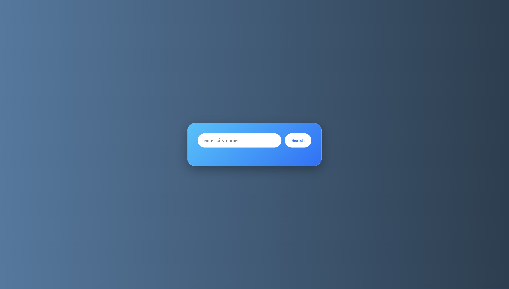
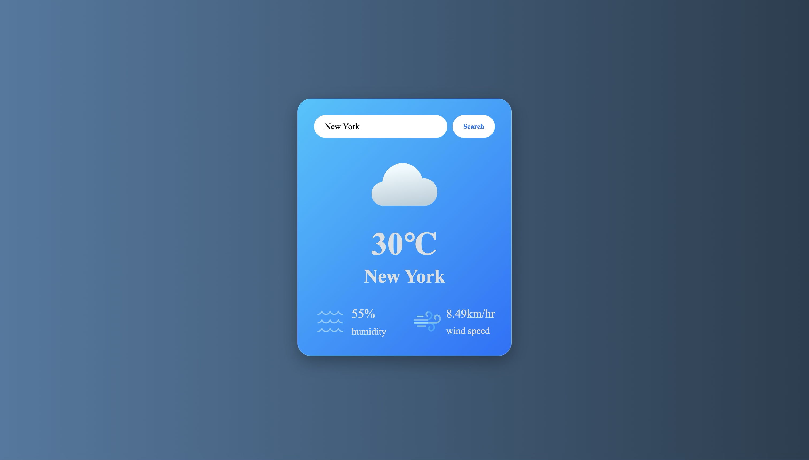
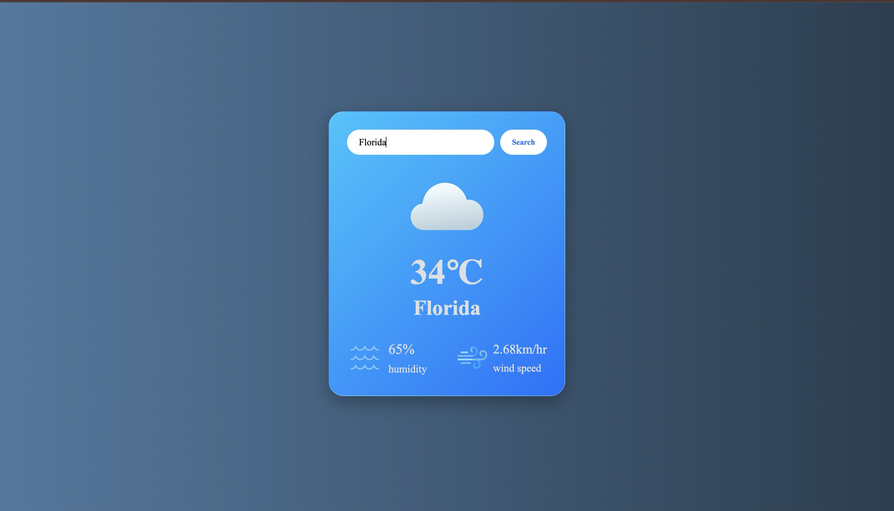

# 🌤️ Weather App

A beautiful, responsive, and easy-to-use weather application that provides real-time weather information for any city around the world. Built with a sleek glassmorphism UI to provide an excellent user experience.

🚀 **Live Demo:** [https://weather-app-mu-rose-65.vercel.app/](https://weather-app-mu-rose-65.vercel.app/)

## ✨ Features
- **Real-Time Data:** Fetch up-to-date weather conditions, temperature, humidity, and wind speed for any location globally.
- **Sleek UI/UX:** A modern, clean interface featuring a gorgeous glassmorphism card design and dynamic aesthetic gradients.
- **Fast & Lightweight:** Built using vanilla web technologies, ensuring rapid load times and smooth performance.
- **Responsive Design:** Completely optimized for both desktop and mobile devices.

## 📸 Screenshots

### Search View


### Weather Data View


### Another City View


## 🛠️ Technologies Used
- **HTML5:** For the structural foundation.
- **CSS3:** For styling, Flexbox layout, animations, and the glassmorphism effect.
- **JavaScript (ES6):** For handling user interactions, fetching data from the Weather API, and dynamically updating the DOM.

## 🚀 Setup & Local Installation
If you want to run this project locally, simply follow these steps:

1. Clone the repository:
   ```bash
   git clone https://github.com/ragini-002/Weather-App.git
   ```
2. Navigate to the project directory:
   ```bash
   cd Weather-App
   ```
3. Open `index.html` in your favorite web browser. No local server is required!
